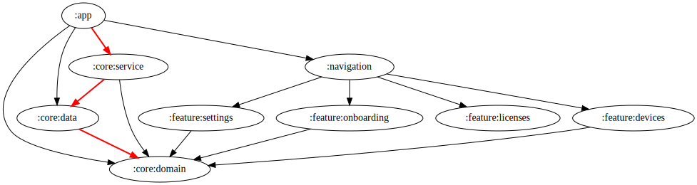

# AndroidPods

[](https://github.com/ai-kurou/AndroidPods/actions/workflows/on-main-merge.yml)
[](https://codecov.io/github/ai-kurou/AndroidPods)
[](https://qlty.sh/gh/ai-kurou/projects/AndroidPods)
[](https://app.codacy.com/gh/ai-kurou/AndroidPods/dashboard?utm_source=gh&utm_medium=referral&utm_content=&utm_campaign=Badge_grade)

AirPodsなどのApple製Bluetoothイヤホンの電池残量を、Androidのシステムオーバーレイでリアルタイム表示するアプリです。

## Screenshots


## Features

- BLEスキャンによる互換デバイスの自動検出
- システムオーバーレイによるリアルタイム電池残量表示
- Foreground Serviceでのバックグラウンド監視
- テーマ（Light / Dark / System）とオーバーレイ位置のカスタマイズ
- 初回セットアップウィザード

## Requirements

- Android 9 (API 28) 以上
- Bluetooth LE対応端末
- Apple製Bluetoothイヤホン（AirPodsなど）

## Architecture

Kotlin + Jetpack Composeによるマルチモジュール構成のClean Architecture。

```
:app → :navigation → :feature:* → :core:domain ← :core:data
```

| モジュール | 役割 |
|---|---|
| `:app` | エントリーポイント・テーマ管理 |
| `:navigation` | 全ナビゲーションルートの一元管理 |
| `:core:domain` | リポジトリインターフェース・UseCase |
| `:core:data` | リポジトリ実装・Hilt DIモジュール |
| `:core:service` | BLEスキャンとオーバーレイ通知（Foreground Service） |
| `:feature:devices` | デバイス一覧画面 |
| `:feature:settings` | 設定画面 |
| `:feature:onboarding` | 初回セットアップウィザード |
| `:feature:licenses` | OSSライセンス一覧 |

## Contributing

This project does not accept pull requests.  
You are welcome to fork and modify for personal use.

## License

[GPL-3.0](LICENSE)

<!-- MODULE-GRAPH-START -->
## Module Graph


<!-- MODULE-GRAPH-END -->
