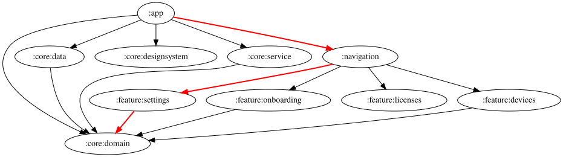

# AndroidPods

[日本語版はこちら](README.ja.md)

[](https://github.com/ai-kurou/AndroidPods/actions/workflows/on-main-merge.yml)
[](https://codecov.io/github/ai-kurou/AndroidPods)
[](https://qlty.sh/gh/ai-kurou/projects/AndroidPods)
[](https://app.codacy.com/gh/ai-kurou/AndroidPods/dashboard?utm_source=gh&utm_medium=referral&utm_content=&utm_campaign=Badge_grade)
[](https://sonarcloud.io/summary/new_code?id=ai-kurou_AndroidPods)

[](LICENSE)
[](https://github.com/ai-kurou/AndroidPods/releases)


An Android app that displays the battery levels of Apple Bluetooth earphones such as AirPods in real time using a system overlay.


## Features

- Automatically detects compatible devices using BLE scanning
- Displays battery levels in real time using a system overlay
- Monitors devices in the background with a Foreground Service
- Customizes the theme (Light / Dark / System) and overlay position
- Shows a list of detected devices
- Guides first-time setup with an onboarding wizard
- Automatically sends crash reports to Firebase Crashlytics to help improve the app

## Requirements

- Android 9.0 or later
- Bluetooth LE compatible Android device
- Apple Bluetooth earphones, such as AirPods
- Bluetooth, location, notification, and display-over-other-apps permissions

## Installation

Download and install the latest APK from [Releases](https://github.com/ai-kurou/AndroidPods/releases).

On first launch, AndroidPods guides you through the permissions required for Bluetooth scanning, notifications, and overlay display. To monitor battery levels in the background, exclude the app from battery optimization if needed.

## Contributing

This project does not accept pull requests.
You are free to fork, modify, and redistribute this project under the terms of the [GPL-3.0 license](LICENSE).

## License

[GPL-3.0](LICENSE)

<!-- MODULE-GRAPH-START -->
## Module Graph


<!-- MODULE-GRAPH-END -->

## Test Coverage Graph


## Architecture

Kotlin + Jetpack Compose multi-module Clean Architecture.

```
:app -> :navigation -> :feature:* -> :core:domain <- :core:data
```

| Module | Role |
|---|---|
| `:app` | App entry point, theme application, and Hilt DI graph setup |
| `:navigation` | Centralized screen route management with Navigation Compose |
| `:core:domain` | Repository interfaces, UseCases, and notification channel definitions |
| `:core:data` | Repository implementations, DataStore, and Hilt DI module |
| `:core:service` | BLE scanning, Foreground Service, and overlay notification |
| `:core:designsystem` | Theme, colors, and typography |
| `:feature:settings` | Settings screen |
| `:feature:onboarding` | First-time setup wizard |
| `:feature:devices` | Detected devices screen |
| `:feature:licenses` | OSS licenses screen |
| `:feature:widget` | Widget-related features |
